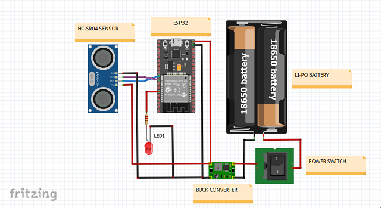
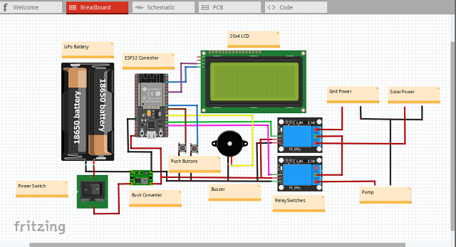

# Wireless_Tank_Level_Monitor

This system aims to wirelessly monitor the water level in a storage tank, automatically turn on the pump when the water level is low, 
turn off the pump when the level is high and switch between two power sources which are Grid and Solar setup.

This system consists of two main parts: the Sensor unit and the Controller unit. 
- The sensor unit is the part that is attached to the water tank to monitor the water level.
- The controller unit is located where you have the control panel for your water pump.

The sensor unit streams data (water level – over Bluetooth) to the controller for appropriate water pumping decisions to be carried out.

REQUIREMENTS

Software:
- Arduino IDE
- Arduino sketch

Sensor module hardware:
- ESP32 board
- HC-SR04 Ultrasonic sensor
- Indicator LED
- Power supply unit (LiPo battery and charging circuit)
- Power switch

Controller module hardware:
- ESP32 Board
- DC Pump
- Relay
- 20x4 LCD screen
- Push buttons 2
- Power supply unit (LiPo battery and charging circuit)

Sensor module circuit
.

Sensor module circuit

  
